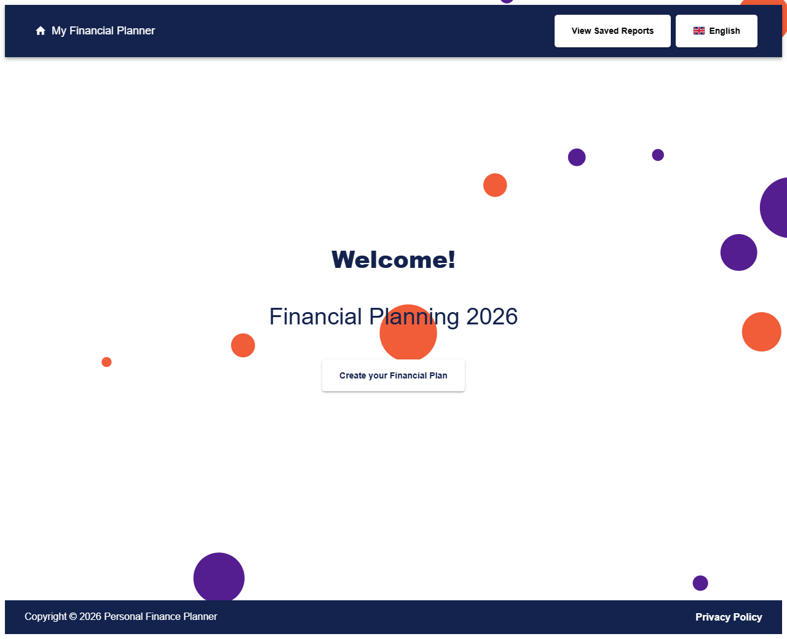
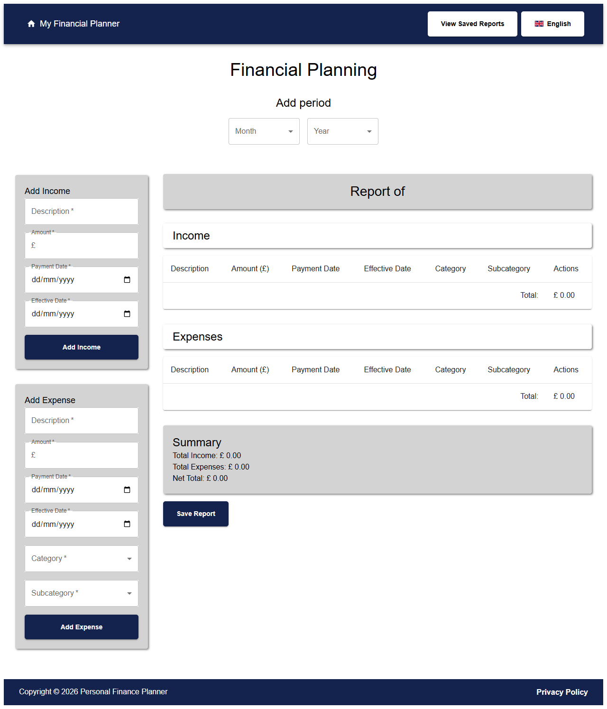
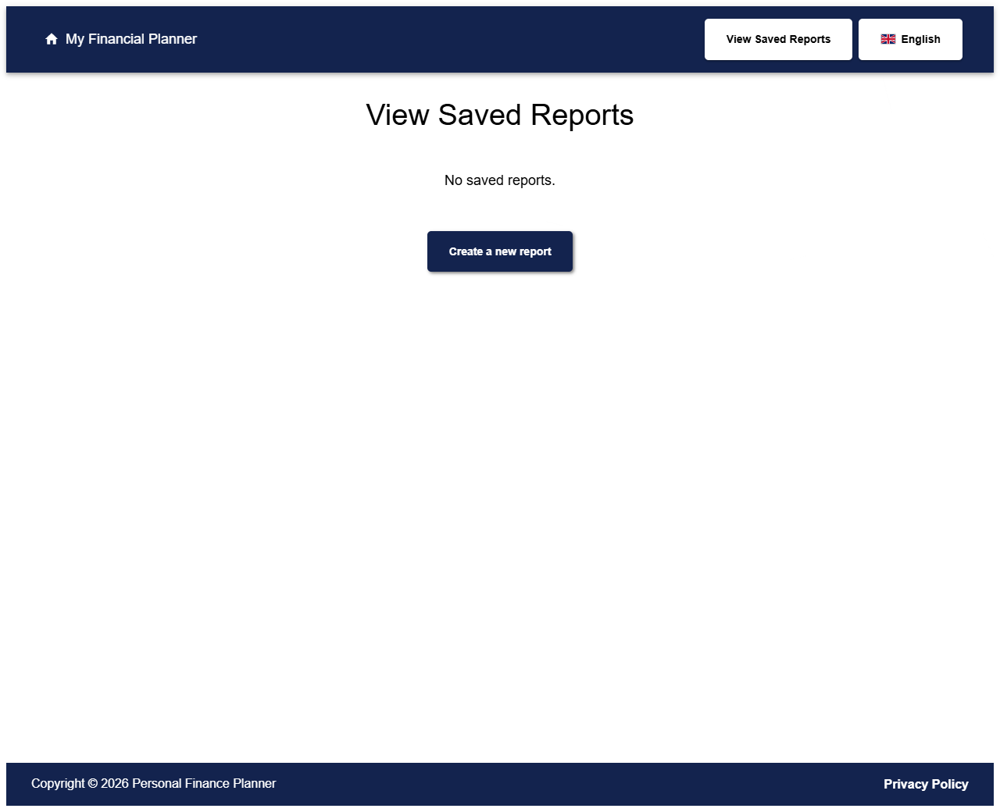
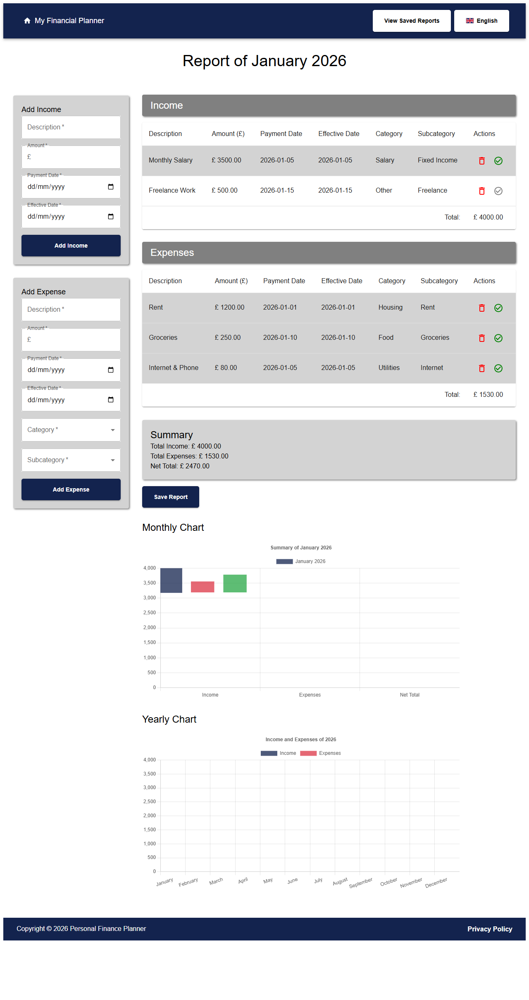

# Personal Finance Planner

Single-page web application for personal financial planning, built with React and Material UI.

The app lets you register income and expenses, organize entries by category/subcategory, save reports, and analyze results with monthly and yearly charts.

## Screenshots

### Home Page



### Create New Report



### Saved Reports



### Report with Data



## Features

- Income and expense registration
- Paid/unpaid status toggle for entries
- Report summary with income, expenses, and net total
- Saved reports with duplicate and delete actions
- Monthly chart in saved report view
- Yearly chart in saved report view (aggregated by month)
- Full interface translation support:
  - English
  - Portuguese (Brazil)
- Language selector in header with UK and Brazil flags
- Home page title year updates automatically to the current year

## Tech Stack

- React 19
- Material UI
- React Router
- Chart.js + react-chartjs-2
- LocalStorage for local persistence

## Run Locally

1. Install dependencies:

```bash
npm install
```

2. Start the development server:

```bash
npm start
```

3. Open in your browser:

[http://localhost:3000](http://localhost:3000)

## Available Scripts

### npm start

Runs the app in development mode.

### npm test

Runs the test runner in interactive mode.

Use this variant for one-off runs (CI-style):

```bash
npm test -- --watchAll=false
```

### npm run build

Builds the production bundle in the build folder.

## Testing Stack

This project uses:

- Jest (test runner, via react-scripts)
- React Testing Library (@testing-library/react)
- jest-dom matchers (@testing-library/jest-dom)

Related files:

- src/App.test.js
- src/setupTests.js

## Main Routes

- / : Home
- /new-relatorio : Create a new report
- /saved-reports : Saved reports list
- /report/:id : Saved report details and editing

## Language

You can switch the interface language from the header language button, next to the saved reports button.

The selected language is persisted in the browser.

## Deployment Notes

When deployed, anyone with the URL can use the app.

This project currently has no backend or authentication layer. All data remains client-side only.

## Data Privacy and Storage

Data is stored in each user's own browser LocalStorage, scoped by origin (domain) and browser profile.

That means:

- Users on different devices/browsers do not automatically share data.
- Your data is not uploaded to a server in the current architecture.
- Data can be removed if browser/site storage is cleared.

## Data Persistence

Data is stored in LocalStorage.

Keys used:

- savedReports
- income
- expenses
- language

## Troubleshooting

### Deprecation warning: punycode

You may see a Node deprecation warning related to punycode while running tests.

This is a transitive dependency warning from tooling in react-scripts and does not block app usage or test execution.

### CRA/Babel warning for private property plugin

If you see a warning mentioning @babel/plugin-proposal-private-property-in-object, install it as a dev dependency:

```bash
npm install -D @babel/plugin-proposal-private-property-in-object
```
